# Project 2 Brief - What is the deal with Seattle Housing Prices?

Zeray Admasu, Joanne Gates, John-Francis Kraemer, and Sumitha Prabhu

## Topic
What Metrics Determine Housing Prices and Can They Be Used to Estimate Housing Prices? 

## Questions:
### What metrics determine housing prices in the Seattle metropolitan area? And are they easily available?
Our group searched for individual housing prices in the greater Seattle metropolitan area and the respective demographics of those houses.  The readily available data on RedFin and Zillow only provides aggregate data by month and does not provide detail of the individual home sales.  We were able to find home sales data by individual data for King County online, however, it was only for 2014-2015.  After valiant research efforts, we were able to access housing data from Windermere Real Estate for the greater Seattle metropolitan area for April 2021 and May 2021.  The data set provided 4,128 recently sold or actively listed house for sale with the sale/listing price, # of bedrooms, # of bathrooms, house square feet, property lot square feet, and the address.  It was not the ideal amount of data (only 4,128), but was the most accurate and recent data available.  In addition to the data provided by Windermere Real Estate, it seemed prudent to incorporate a metric for the individual town/city for each house price.  We were curious if there was a market premium or discount that could be quantified based on the house address based on crime rates or the quality of the school districts.  We were able to find a "Livability Index" online (www.areavibes.com/seattle-wa/livability/) that quantified the quality of a city/town’s amenities, cost of living, crime rates, employment opportunities, and school district.  After incorporating the livability index, we now had 5 independent variables to predict the house price (dependent variable).  After some data scrubbing and cleaning, our dataset was ready to begin training our machine learning methodologies (linear regression, neural networks, decision tree, and random forest) for our analysis.

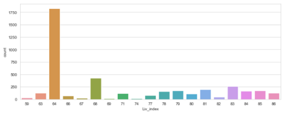
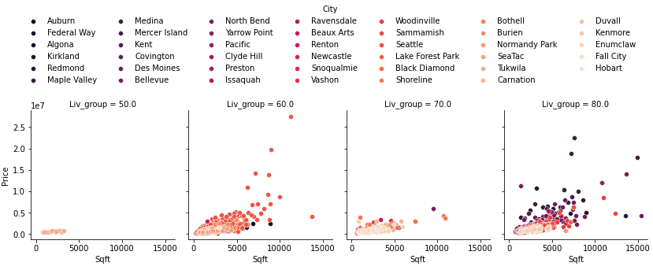
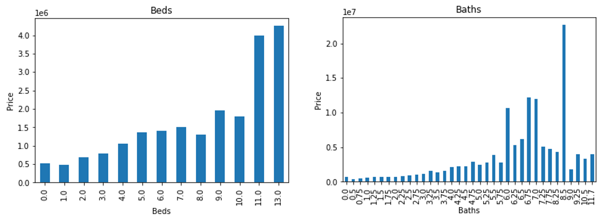

### Do these metrics have a strong individual correlation to prices or is it strong as a group correlation?
The Seattle metropolitan area housing prices during April 2021 and May 2021 were plotted against the selected metrics (# of bedrooms, # of bathrooms, house square feet, property lot square feet, and the Livability Index) to calculate correlation.  # of bedrooms (0.31), # of bathrooms (0.54), house square feet (.69), property lot square feet (.09), and Livability Index (0.20) had a mix of strong to weak positive linear correlations.  House square feet and # of bathrooms had the strongest correlation, conversely property square feet and Livability Index had the weakest linear correlation. 

### Can these metrics be used to train machine learning methodologies (linear regression, neural networks, decision tree, and random forest) to help predict house prices?
#### Linear Regression
The Seattle metropolitan area housing was trained using the linear regression methodology of machine learning.  It generated 5 coefficients for the 5 independent variables and a y-intercept.  It also produced the lowest training accuracy score and second highest testing accuracy score.  The linear equation with the coefficients is defined below:

y = [-306,738 x (number of bedrooms)] + [77,541 x (number of bathrooms)] +  [987,872 x (house sqft)]  - [3,002 x (lot sqft)] + [41,363 x (livability index)] + 1,185,934

The linear regression model provided the following model error statistics:

Train Accuracy Score: 0.50 

Test Accuracy Score: 0.50 

Mean Absolute Error: 420,131.53

Mean Squared Error: 663,699,870,255.79

Root Mean Squared Error: 814,677.77

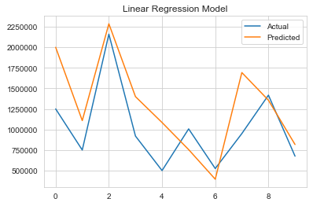
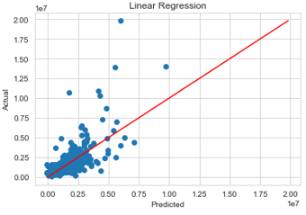

#### Neural Network
Additionally, the Seattle metropolitan area housing was trained using the neural network methodology of machine learning with 5 neurons, 3 layers, a batch size of 128, and 200 epochs.

The neural network provided the following model error statistics:

Mean Absolute Error: 404,762.69

Mean Squared Error: 665,189,975,075.27

Root Mean Squared Error: 815,591.79

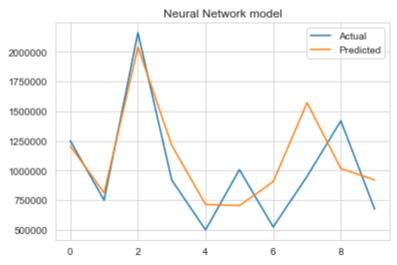
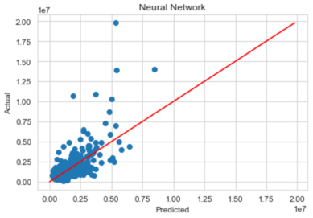

#### Decision Tree
Moreover, the Seattle metropolitan area housing was trained using the decision tree methodology of machine learning.  The decision tree model provided the highest training accuracy score, but also the lowest testing accuracy score.

The decision tree provided the following model error statistics:

Train Accuracy Score 1.00

Test Accuracy Score 0.35

Mean Absolute Error: 423,526.40

Mean Squared Error: 865,222,250,879.20

Root Mean Squared Error: 930,173.24

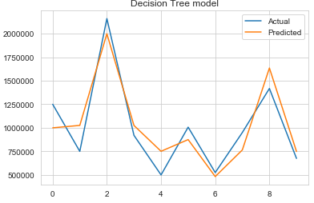
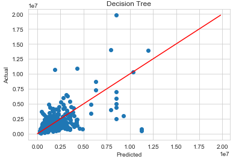

#### Random Forest Regressor
Finally, the Seattle metropolitan area housing was trained using the random forest methodology of machine learning.  The random forest model provided the second highest training accuracy score and the highest overall testing accuracy score.

The random forest provided the following model error statistics:

Train Accuracy Score 0.93

Test Accuracy Score 0.58

Mean Absolute Error: 328,583.78

Mean Squared Error: 559,220,087,806.43

Root Mean Squared Error: 747,810.20

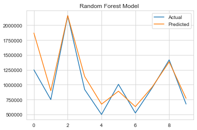
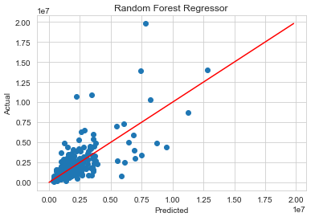

### Conclusion
#### Which machine learning methodologies will provide the most accurate predictions and are they reliable?
#### Can mean absolute error (MAE), mean square error (RMSE), root mean squared error (MSE) be used to assess the reliability of the best machine learning methodology?

Overall, the random forest methodology provided the most reliable model for predicting Seattle housing prices based on its accuracy score of 0.93, but more importantly, it provided the lowest mean absolute error (328,584), mean squared error (559,220,087,806), and root mean squared error (747,810).  All 4 machine learning techniques generated significant margins of error.  To better enhance the reliability and reduce errors, it is recommended to incorporate more data into the analysis.  Both additional amounts of data for the current selected metrics, but also incremental data types (i.e., the year when the house was built, recent renovations, pool, view, walkability score, driveway, size of garage, proximity of recent house foreclosures, etc. ).    

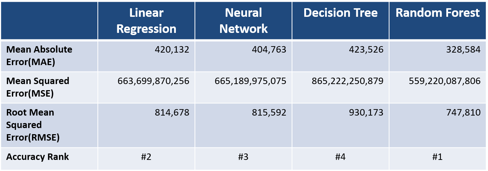

### Graphical User Interface
Additionally, our group created a custom built graphical user interface ("GUI") to display listed sold/active houses and calculate the estimated the price of house based on the user provided metrics.  The GUI will provide a list of houses that were recently sold or are active based on the entered metrics including the zip code.  The GUI will also allow the user to calculate an estimated price for a house based on the entered metrics.  The code for the GUI utilized the linear regression equation that was derived using the machine learning.  Upon review of test samples of actual vs. predicted, the equation was modified to include a constant a variable that in this case divided the entire calculated house value by 5,000.  The final linear equation to derive housing prices is below:

y = [[-306,738 x (number of bedrooms)] + [77,541 x (number of bathrooms)] +  [987,872 x (house sqft)]  - [3,002 x (lot sqft)] + [41,363 x (livability index)] + 1,185,934] /5,000

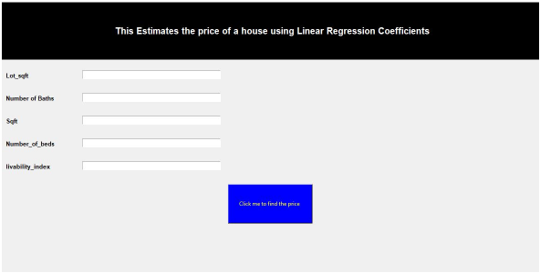
